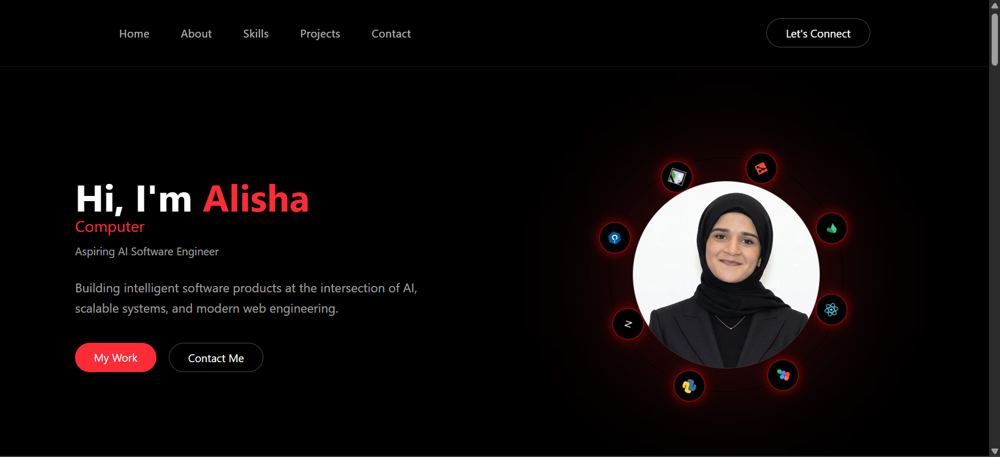

# Alisha Bukhari — Developer Portfolio
Full-stack developer and computer engineering student building AI-driven software products and interactive web applications.

🌐 **Live Website**  
👉 https://alisha-portfolio-phi.vercel.app/

---
## Preview



---

## About

This is my personal developer portfolio built to showcase my projects, technical skills, and software engineering experience.

I am a **Computer Engineering student at Ilia State University** focused on building intelligent systems and scalable software products.

My work combines:

• AI-driven applications  
• Full-stack web development  
• Embedded systems projects  
• UI/UX product design  

---

## Tech Stack

This portfolio is built using modern web technologies:

- **Next.js**
- **React**
- **TypeScript**
- **TailwindCSS**
- **Framer Motion**
- **Vercel (Deployment)**

---

## Features

The portfolio includes:

• Animated hero section with typing effect  
• Interactive tech orbit animation  
• Responsive modern UI design  
• Project showcase with modal details  
• Smooth scroll navigation  
• Skills visualization with animated progress bars  
• Contact form integration  

---

## Projects Featured

The website highlights several of my technical projects:

### CareerGPS
AI-powered career roadmap platform designed to guide users through structured learning paths.

### Self-Balancing Seesaw
Embedded systems project using **STM32**, **PID control**, and **MPU6050 IMU** to balance a motor-driven seesaw.

### RFID Attendance System
RFID-based attendance logger with **RTC timestamps** and **EEPROM storage**.

### Pygame Chess
Two-player chess game built in Python with rule validation and move highlighting.

### UI/UX Designs
Mobile and web interface designs created in **Figma** including:

• Wanderlust travel UI  
• CraveMore food ordering app  

---

## Getting Started (Local Development)

Clone the repository:

```bash
git clone https://github.com/alishabukhari/alisha-portfolio.git
```

## Install dependencies:
```
npm install
```

## Run the development server: 
```
npm run dev
```

## Open:
```
http://localhost:3000
```

## Deployment

The portfolio is deployed using Vercel.

Every push to the main branch automatically triggers a new deployment.

## Contact

If you'd like to connect or collaborate:

📧 Email
alishabuk12@gmail.com

💼 LinkedIn
https://www.linkedin.com/in/alisha-bukhari/

💻 GitHub
https://github.com/alishabukhari

---

⭐ If you like this project, consider starring the repository.

